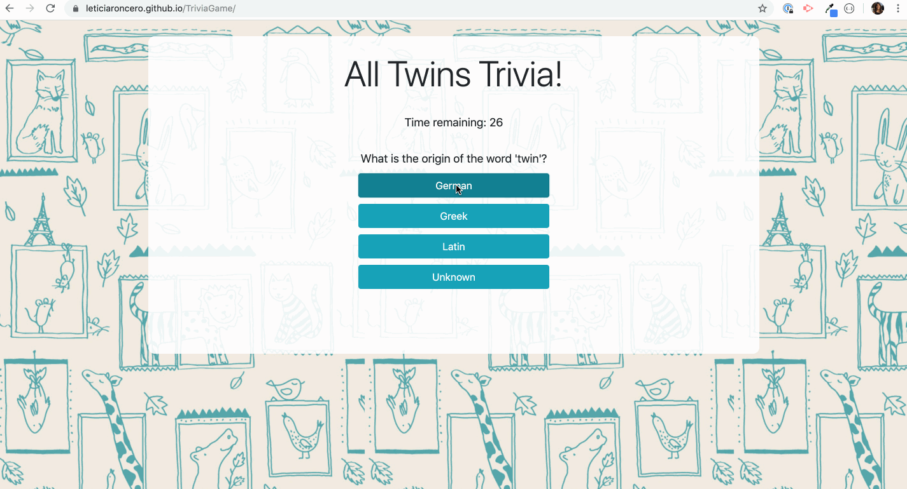
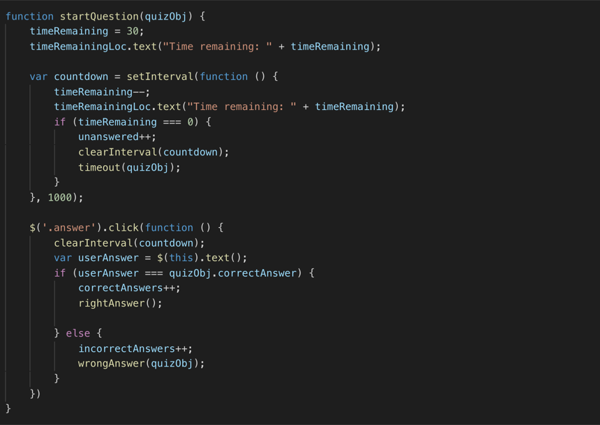
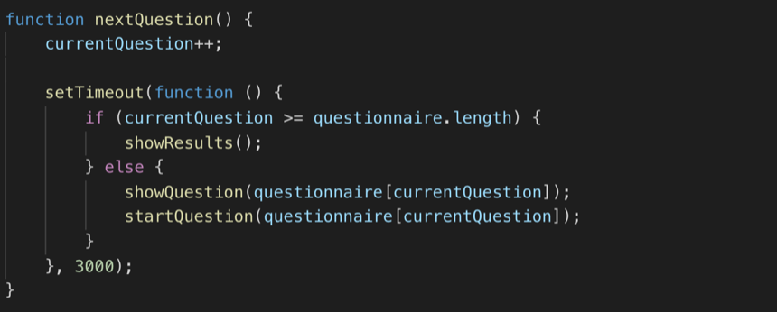
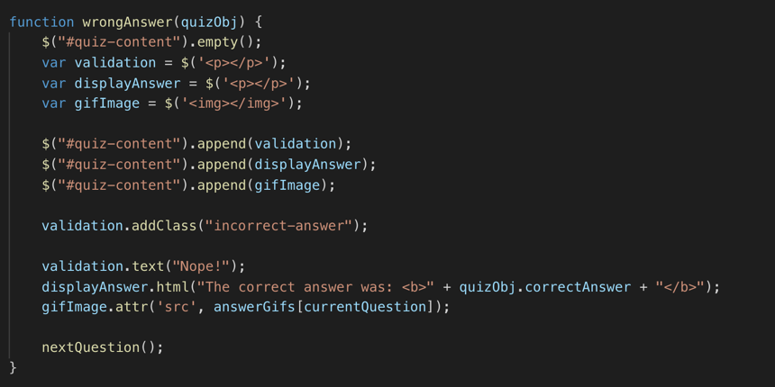

# TriviaGame

## Description
This trivia game was developed using JavaScript and jQuery. One question is shown at a time while a timer ticks down. When we click an answer, it will tell us whether or not we are correct or incorrect, and it will move on to the next question. The final screen will show the total number of correct, incorrect, and unanswered questions. The game's theme is all about twins!

## Technologies used

* JQuery
* JavaScript
  * Timers
* HTML5
* CSS
* Bootstrap

## GIF Walkthrough

## Essential Code

Logic to start the timer and listen for clicks in the answers:

Logic to navigate to the next question after 3 seconds:

Logic to display the screen when the user selects a wrong answer:

## Game URL

[All Twins Trivia!](https://leticiaroncero.github.io/TriviaGame/)

## Image Credit
Background image: ["Patterns for wallpapers"](https://www.behance.net/gallery/4228169/Patterns-for-wallpapers) by Little Cube is licensed under CC BY-NC-ND 4.0 